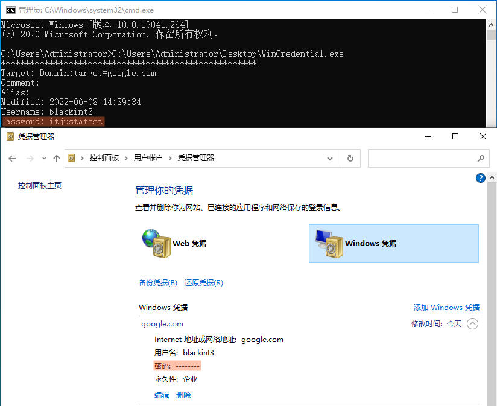

# WinCredential
```Remote call LsaICryptUnprotectData in LSASS.exe to decrypt windows credentials.```

### History
Many years ago, I focus in LSA research and reverse winlogon authentification.

The tool can decrypt windows credentials not normal types.

BTW, Many tools use CredRead/CredWrite API that only get normal credentials, it so easy.

### Usage
Build and Run it.



### Requirements
- Works on WinXP/7/10/11 (x86/x64)
- Build with Visual Studio 2010+
- According target OS archtecture, build x86/x64 binary respectively.
- UAC elevated required.

### Related
- Using CredRead: https://gist.github.com/nzbart/9400412
- CredRead API: https://docs.microsoft.com/en-us/windows/win32/api/wincred/nf-wincred-credwritea